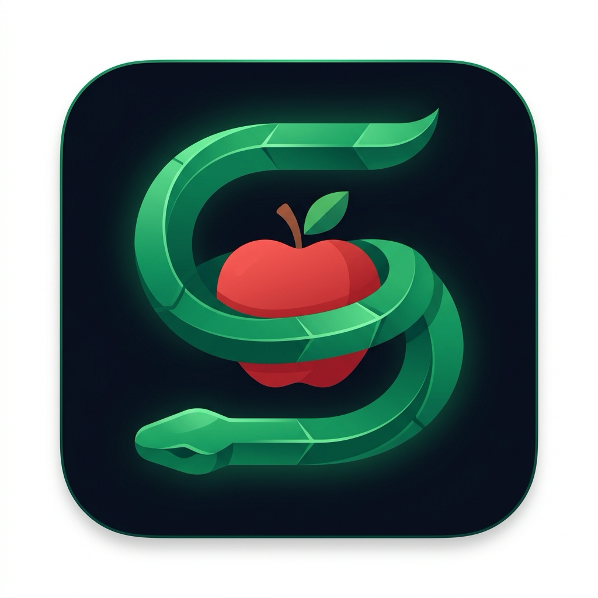
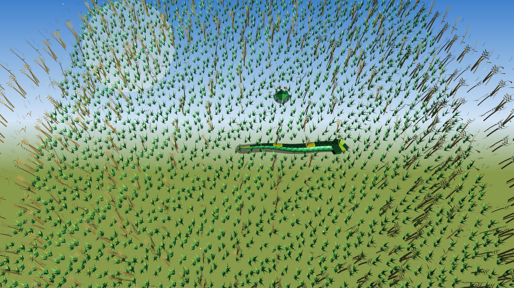
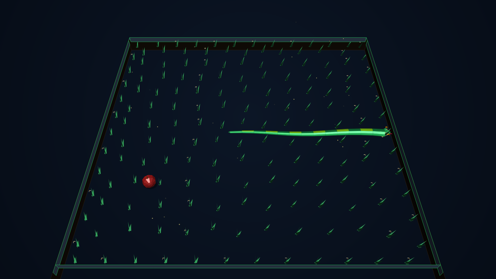
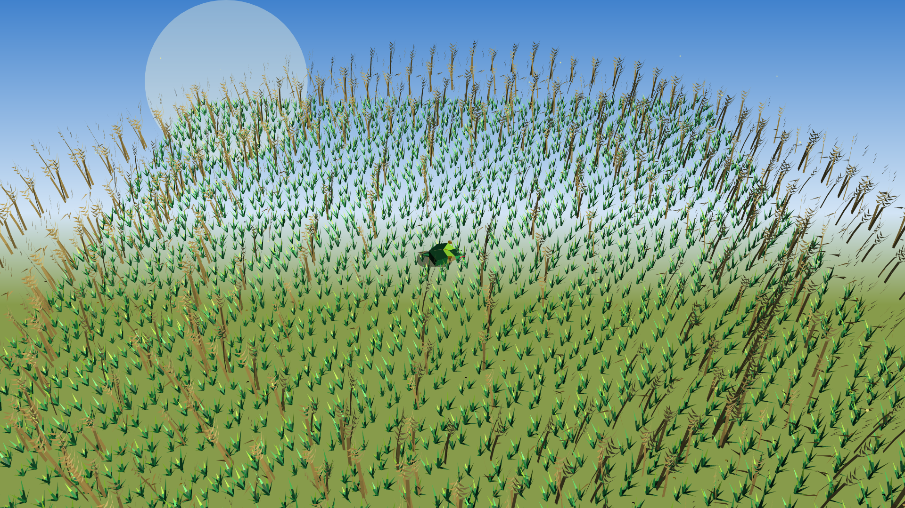

# 🐍 Snake 3D: Slither Arena

<div align="center">
  
  <h3>The Ultimate 3D Remake of the Classic Snake Game</h3>
  <p>Built with <b>Uno Platform</b>, <b>SkiaSharp</b>, and <b>.NET 10</b> targeting <b>macOS</b>, <b>Windows</b>, and <b>Linux</b>.</p>
</div>

---

<div align="center">
  
</div>

---

## 🎮 Screenshots

<div align="center">
  <table style="width: 100%; border: none;">
    <tr>
      <td width="50%" align="center">
        <b>3D Gameplay in 24x24 Meadow</b><br/><br/>
        
      </td>
      <td width="50%" align="center">
        <b>Golden Apple Action & Particles</b><br/><br/>
        
      </td>
    </tr>
    <tr>
      <td colspan="2" align="center">
        <br/><b>3D Orbiting Main Menu & Speed Selector</b><br/><br/>
        
      </td>
    </tr>
  </table>
</div>

---

## ✨ Features

- **Built on .NET 10**: High-performance C# 13 / .NET 10.0 runtime targeting macOS, Windows, and Linux.
- **Custom High-Fidelity 3D Rendering Pipeline**:
  - Elevated perspective camera with dynamic tracking and menu orbit showcase.
  - Multi-faceted 3D geometry for grass lawn tiles, dense swaying 3D grass tufts, blooming meadow flowers, and stone perimeter walls.
  - Continuous 10-sided tubular snake mesh with natural lateral serpentine slither waves and progressive anatomical tapering.
  - **Digestion Bulge Animation**: A 3D food lump realistically travels down the snake's vertebrae when apples are eaten.
  - Sculpted viper head with amber glass eyes, slit pupils, nostrils, and animated flicking fork tongue.
  - Blinn-Phong specular lighting, soft floor drop shadows, and floating 3D ambient fireflies.
  - High-poly sculpted 3D Apple with wooden stem and green leaf (+ glowing gilded Golden Apple).
  - 3D celebration particle fountain bursts with gravity and floor bounce physics.
- **Speed & Difficulty Modes**:
  - 🐢 **Relaxed**: Comfortable, Zen pace for beginners.
  - 🎯 **Normal**: The classic arcade challenge.
  - ⚡ **Fast**: High-octane reflex test.
- **Automated Store Publishing Workflows**:
  - **Microsoft Partner Center / Windows Store** MSIX publishing via GitHub Actions ([windows-store-publish.yml](.github/workflows/windows-store-publish.yml)).
  - **Canonical Snap Store / Linux Snap** publishing via GitHub Actions ([linux-snap-publish.yml](.github/workflows/linux-snap-publish.yml) & [snap/snapcraft.yaml](snap/snapcraft.yaml)).
- **Automated Test Suite**:
  - 20 unit tests covering domain logic, direction safety, food collision, snake growth, and scoring.

---

## 🎮 Controls

| Key | Action |
|---|---|
| **W / Up Arrow** | Move Up / North |
| **S / Down Arrow** | Move Down / South |
| **A / Left Arrow** | Move Left / West |
| **D / Right Arrow** | Move Right / East |
| **Space** | Pause / Resume / Start |
| **Enter** | Start / Restart |
| **Escape** | Pause / Return to Menu |

---

## 🚀 How to Build & Run

### Prerequisites
- [.NET 10.0 SDK](https://dotnet.microsoft.com/download/dotnet/10.0)

### macOS Desktop (Skia Desktop)
```bash
# Build the solution
dotnet build Snake3D.slnx

# Launch the game
dotnet run --project Snake3D/Snake3D.csproj -f net10.0-desktop
```

### Linux Desktop (X11 / Wayland)
```bash
dotnet run --project Snake3D/Snake3D.csproj -f net10.0-desktop
```

### Windows Desktop (WinUI 3 / Skia Desktop)
```bash
dotnet run --project Snake3D/Snake3D.csproj -f net10.0-windows10.0.26100
```

---

## 🧪 Running Automated Tests

```bash
dotnet test
```

---

## 📦 Store Packaging & Secrets

Refer to [STORE_SETUP_GUIDE.md](STORE_SETUP_GUIDE.md) and [assets/store/STORE_LISTINGS.md](assets/store/STORE_LISTINGS.md) for full Microsoft Partner Center and Canonical Snap Store configuration steps.
